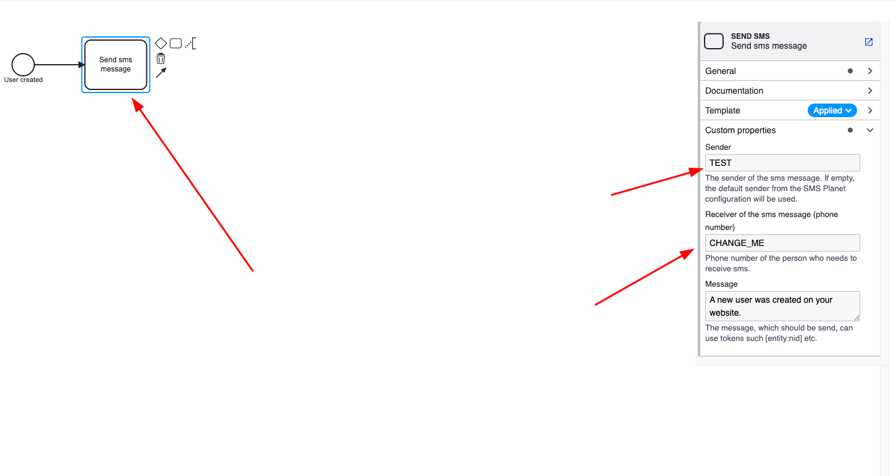

## What does this module do and why?

This module provides a simple integration with [SMS Planet API](https://smsplanet.pl/).

It comes with a custom ECA plugin that allows to send sms messages based on various conditions, there is one model already preconfigured, which is to send a message on a new account creation.

## Requirements

<b>Before enabling this module, you need to install smsplanet-php-client composer package.</b>

As of today, there is no stable version, so you need to change minimum-stability in composer.json to dev.

Assuming you're using ddev, simply run `ddev composer require smsplanet/smsplanet-php-client`.

To make the encrpytion module work, generate a random key and add it to your settings.php or settings.local.php file:
```
dd bs=1 count=32 if=/dev/urandom | openssl base64
```


```php
/**
 * This encryption will be used to encrypt and decrypt values by the encryption
 * module.
 *
 * The value should shared between sites that share encrypted configuration. If
 * the `encryption_key` were to change encrypted data/configuration would be in
 * a corrupt state until the correct encryption key were recovered.
 */
$settings['encryption_key'] = 'your_key=';
```
<b>In order to use this module you need to install and enable [Encryption](https://www.drupal.org/project/encryption), [ECA](https://www.drupal.org/project/bpmn_io) and [bpmn_io](https://www.drupal.org/project/bpmn_io).</b>

Also, enable the following extensions for ECA (they will all be available after installing base ECA and bpmn_io): <b>ECA Base, ECA UI, ECA Content, ECA Config, ECA User, ECA Workflows, ECA BPMN.</b>

<br>

<h3>Note for drupal 11</h3>
As of today (14.12.2024), there is no official version for the encryption module, there is hover an automated d.org patch that can be applied to temporarily resolve this issue.
in your composer.json file add the following repository:
```json
{
  "type": "vcs",
  "url": "https://git.drupalcode.org/issue/encryption-3430116"
}
```

and then add this specific version with the drupal 11 compatibility:
```json
  "drupal/encryption": "dev-project-update-bot-only"
```

## Installation

Install the module to apply the configuration.

After installation, you need to configure the SMS Planet API credentials in the module settings.

Go to `/admin/config/services/sms-planet-settings` and fill in the API key and API secret.

For the ECA action to work, go to the ECA model that was imported with the configuration and set fill in the Sender and Recipient fields to your liking <b>(note that sender needs to be all uppercase)</b>.



If you want to use the functionality and send sms messages outside the ECA, there is a blueprint ready in

`/src/Form/SmsContentForm.php`


## Maintainers

Module maintainer: Patryk Krzaczkowski
